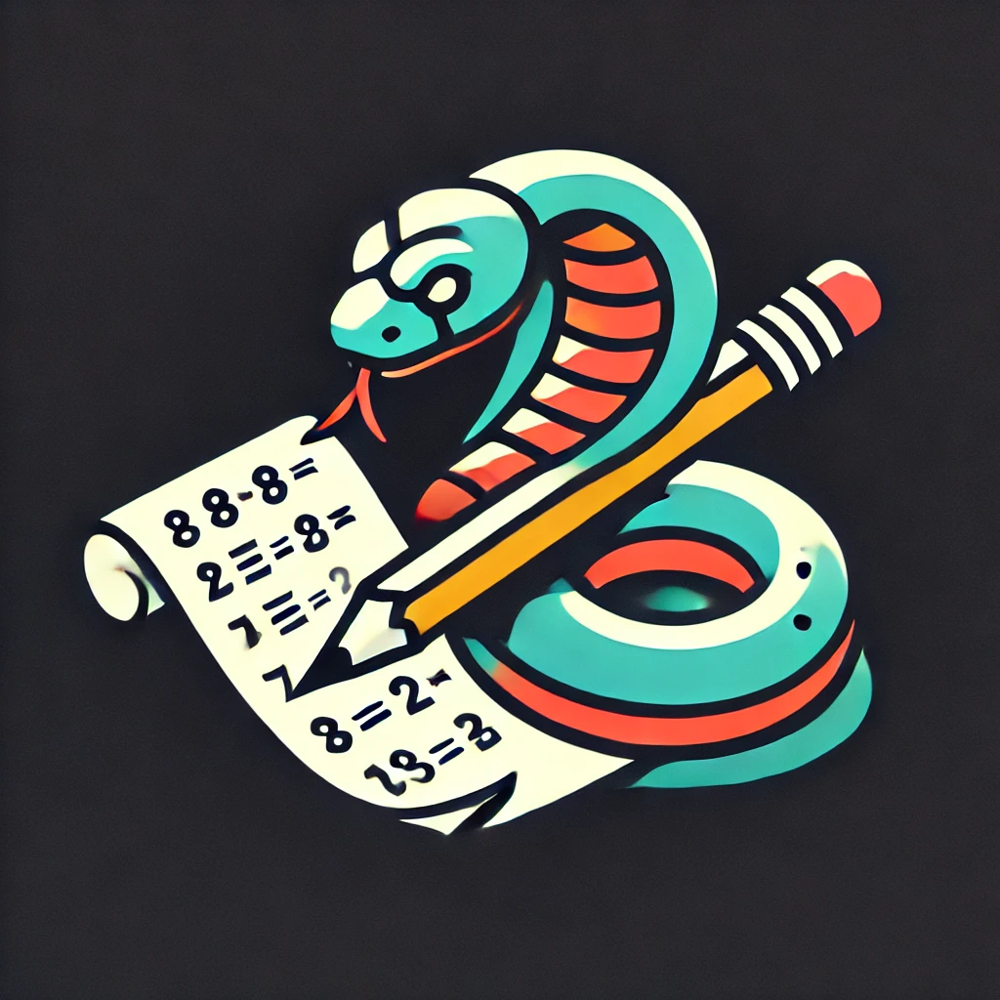

 
  <a href="https://www.linkedin.com/in/kauan-modolo-carriço" target="_blank"> 
  
    

<h1> JOGO DE CÁLCULO PYTHON </h1>

# 👨‍💻 O PROJETO
Este é um jogo feito em Python com interface e arquivo executável que consiste em perguntas com cálculos matématicos do entre os níveis 1 ao 4. O jogador deve somar pontos e ao fim tentar bater seu próprio récorde ou de outro jogador com uma funcionalidade de leaderboard.

# 👨‍💻 ABOUT THE PROJECT
This is a game made in Python with an interface and executable file that consists of questions with mathematical calculations from levels 1 to 4. The player must add points and at the end try to beat his own record or that of another player with a leaderboard functionality.

## Getting Started
Basta baixar o arquvo exe da pasta "dist" e executa-lo.

## 🚀 TECNOLOGIAS
Essas são as tecnologias utilizadas no projeto:
 
 
Python
tkinter library
